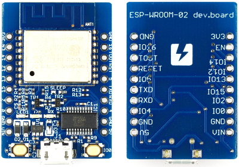

# ATS programing on ESP8266 [](https://travis-ci.org/fpiot/esp8266-ats)

## Demo code

xxx

## Hardware: [ESP-WROOM-02](http://espressif.com/en/products/wroom/)

[](https://www.switch-science.com/catalog/2500/)

You need [some additional board](https://www.switch-science.com/catalog/2500/) to connect between ESP-WROOM-02 and your PC.

## Setup environment

xxx

## How to build

Install ATS2 http://www.ats-lang.org/.

```
$ tar xf ATS2-Postiats-X.Y.Z.tgz
$ export PATSHOME=`pwd`/ATS2-Postiats-X.Y.Z
$ export PATH=${PATSHOME}/bin:${PATH}
$ tar xf ATS2-Postiats-contrib-X.Y.Z.tgz
$ export PATSHOMERELOC=`pwd`/ATS2-Postiats-contrib-X.Y.Z
$ cd ${PATSHOME}
$ ./configure
$ make
```

Compile the ATS source code for ESP8266.

```
$ cd esp8266-ats/blinky_ats
$ make
$ ls firmware
0x00000.bin  0x40000.bin
```

## Write to the flash

Connect ESP8266 board to your PC using USB cable.
And run following commands.

```
$ cd esp8266-ats/blinky_ats
$ make flash
/home/kiwamu/src/esp-open-sdk/esptool/esptool.py --port /dev/ttyUSB0 write_flash 0x00000 firmware/0x00000.bin 0x40000 firmware/0x40000.bin
Connecting...
Erasing flash...
Wrote 27648 bytes at 0x00000000 in 2.7 seconds (80.4 kbit/s)...
Erasing flash...
Wrote 183296 bytes at 0x00040000 in 18.3 seconds (80.3 kbit/s)...

Leaving...
```

## How to debug using gdb

T.B.D.
